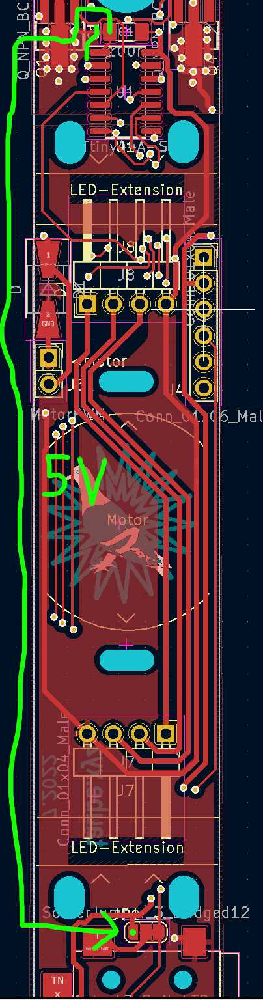

# FlashDisc

You can view the interactive BOM of the Flashdisc by an interpreter like this: 

http://htmlpreview.github.io/?https://github.com/schaum/FlashDisc/blob/main/FlashDisc-BOM.html

## PCB Version 3 Fixes

The PCB of version 3 needs some fixes. The micro-processor needs to be decoupled from the motor-driver next to it. Cut the two 5V supply-tracks of the chip with a sharp knife and connect the power of the chip to 5V on the board as far as possible from the motor driver with some wire, for example to the small pad marked here with a green dot:

## mounting

Make shure everything is soldered and the fix is made, the motor cables can be connected in both directions. The choice of the direction will have an effect on the sense of rotation.

If the motor doesn't start after the fixes, you might have cut the conductive path close to the large hole that controls the motor.

**USB-C**: The USB-C connector is used only for powering the PCB with 5V. You only have to solder the 4 outer pins.

**Motor**: clip in the holder clip of the motor to the circuit board (maybe the printing supports need to be removed first), clip the motor. Press the green disc holder onto the axis.

**For each of the two LED-Extension-Boards**: Place the spacer with the three fingers, put on the underlay plate, connect the extension board, fix it with a clipper. The clipper might be tight, you can sand the edges a bit for an easier installation.

(picture to come here)

## manual

- Draw or cut your disc
- plug the circuit to a 5V power supply
- push the center button of the joystik to start
- tune the motor speed: joystik up or to the right once or twice to increase the speed, down or left to lower the speed