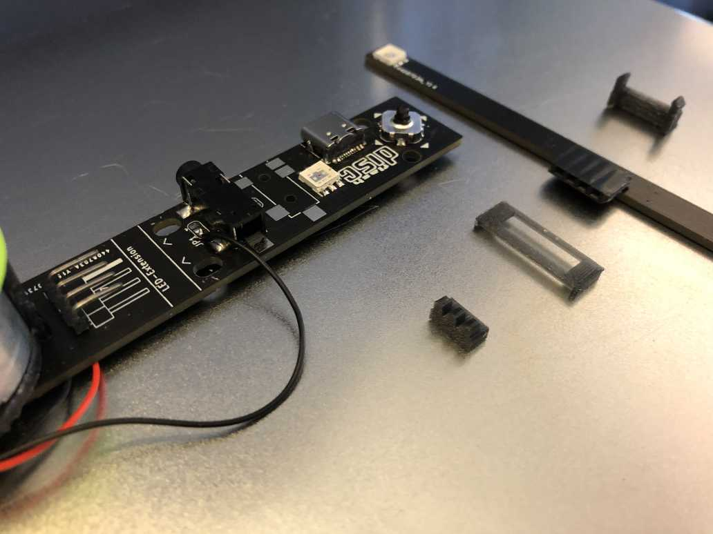
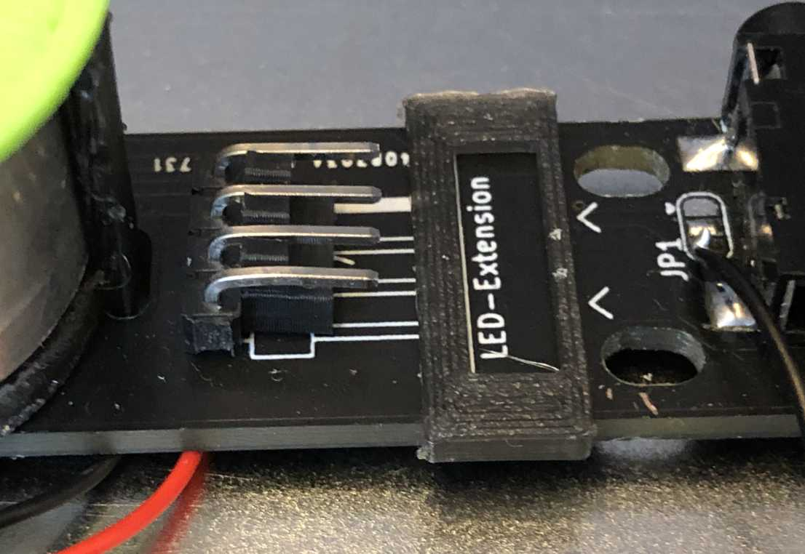
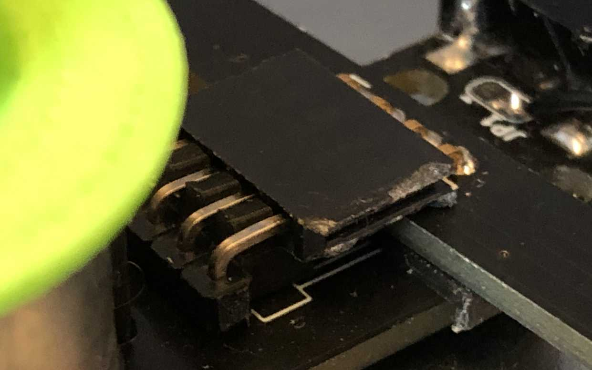
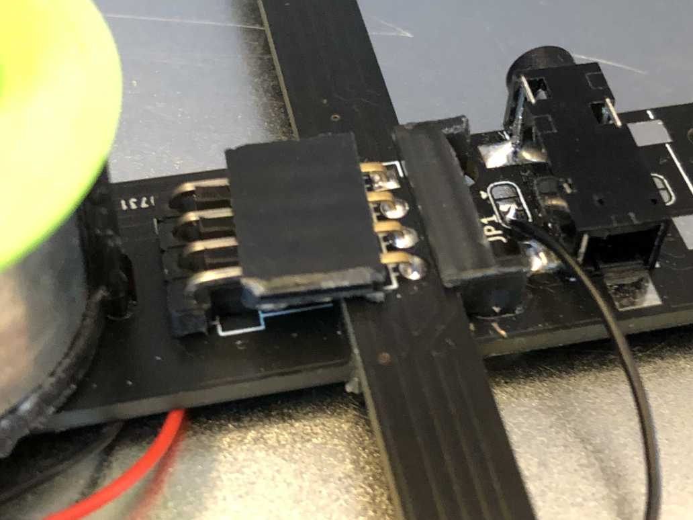

# FlashDisc

You can view the interactive BOM of the Flashdisc by an interpreter like this: 

http://htmlpreview.github.io/?https://github.com/schaum/FlashDisc/blob/main/FlashDisc-BOM.html

Watch out for the directions of the Diode, the LEDs, the chip (mark at the longer line) and the joy-stick (mark at the bottom right).

## mounting

Make shure everything is soldered and the fix is made, the motor cables can be connected in both directions. The choice of the direction will have an effect on the sense of rotation.

If the motor doesn't start after the fixes, you might have cut the conductive path close to the large hole that controls the motor.

**USB-C**: The USB-C connector is used only for powering the PCB with 5V. You only have to solder the 4 outer pins.

**Motor**: clip in the holder clip of the motor to the circuit board (maybe the printing supports need to be removed first), clip the motor. Press the green disc holder onto the axis.

**For each of the two LED-Extension-Boards**: 

Place the spacer with the three fingers and put on the underlay plate.

Connect the extension board. 

Fix it with a clipper. The clipper might be tight, you can sand the edges a bit for an easier installation.

## manual

- Draw or cut your disc
- plug the circuit to a 5V power supply
- push the center button of the joystik to start
- tune the motor speed: joystik up or to the right once or twice to increase the speed, down or left to lower the speed

## Designs of Discs

Check out [the sample FlashDiscs](FlashDiscs/) for an inspiration on how to create discs.